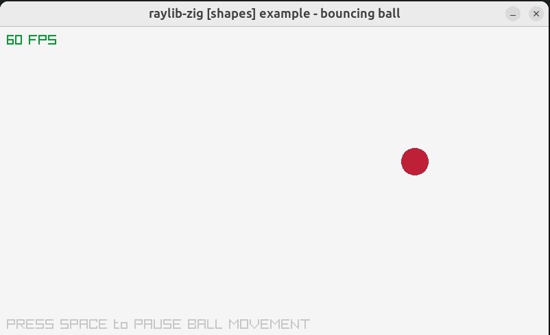

# Phyzigs Engine

This repo is a simple physics engine written in zig. In order to render, we use
raylib bindings.



## Design

The rough design of this repo is:

```
src/Main.zig -- main loop
src/Engine.zig -- engine code
src/World.zig -- representation of the world
src/Renderer.zig -- rendering of World
```
